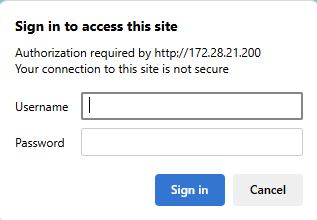

# 🔧 Configuring a Dinstar Port and Extension number Integrating with Alcatel OMC

Follow these steps to add and configure a new port and extension number in Dinstar and connect it with the Alcatel OmniPCX system via OMC.

---

## 🛠️ Step-by-Step Instructions

### 1. Access Dinstar Web Interface
- Open your browser and log in to the **Dinstar** device using the correct credentials.

### 2. Add a New Port
- Click on **Add Port**.

- Assign the **Extension Number** to the available port.

- Enter the **New Extension Number** you’ve planned in the placeholder of **Primary SIP User ID and Primary Authenticate ID** (e.g., `303`).

- Click **Save**.
---

## 🧩 Configure the Same Extension in OMC

### 3. Open OMC (OmniPCX Office Management Console)
- Log in to **OMC**.

### 4. Open Subscriber/Basestation
- to add new extension open subscriber/basestation 

### 5. Add a New Extension
- Click on **Add**.

- Enter the **New Extension Number** you’ve planned (e.g., `303`).

- Click **OK**.

### 6. Return to Subscriber List
- You’ll be taken back to the **Subscribers** list.
- The new extension will appear there.

### 7. Change Device Type to Open SIP Phone in Terminal
- By default, the extension will be set as **IP Enabler**.

- Change the type from **IP Enabler** to **Open SIP Phone**.

- click **Modify** to access its configuration settings.

---

## ✅ Extension is added!
The extension is now added and ready for SIP configuration or registration with a compatible SIP device.

### 9. Edit Extension Number Details
- Select the extension number you just added and either:
  - Click **Details**, or
  - Double-click the extension number to open its settings.

### 10. Go to IP/SIP Settings
- In the port settings, go to the **IP/SIP** tab.

### 11. Open SIP Parameters
- Click on the **SIP Parameter** section.

### 12. Copy SIP Password
- Locate and **copy the SIP Password** from this section.

- Click **OK** to close the dialog.
- Click **OK** again to confirm.

---

## 🔁 Finalize Dinstar Configuration

### 13. Return to Dinstar
- Go back to the port settings in **Dinstar**.

### 14. Reopen the New Port added
- Select the port, **Modify the newly created port** for further configuration.

### 15. Paste SIP Password
- Paste the copied SIP Password into the **Primary Authentication Password** field.

### 16. Save Configuration
- Click **Save**.

---

## ✅ Done!
- The port is now configured and linked to the Alcatel system.
- You’re all set!

---

