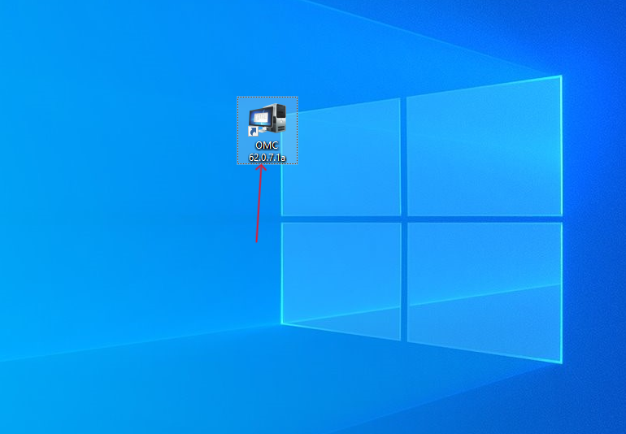
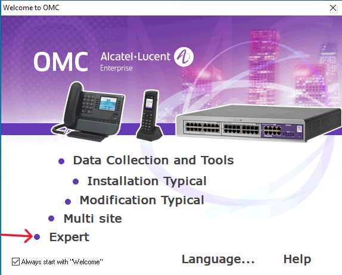
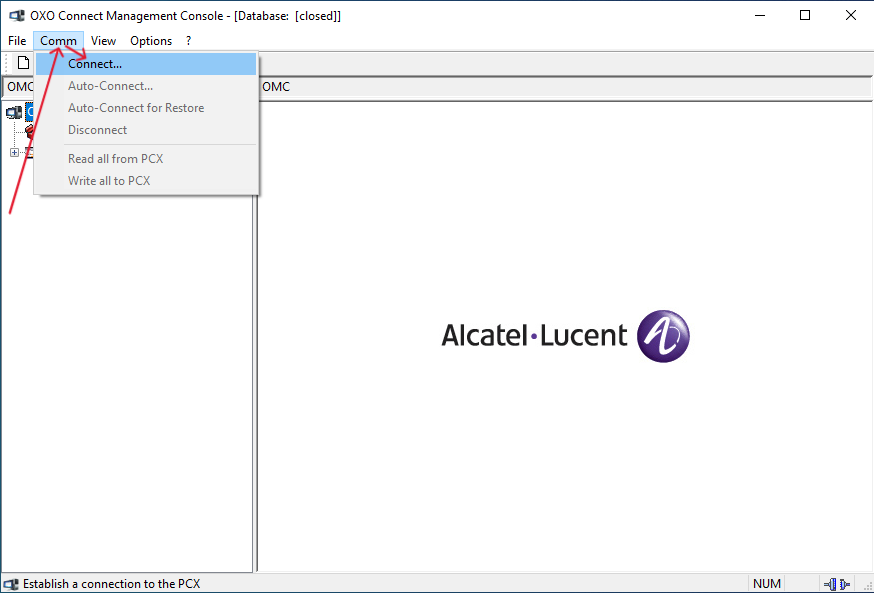
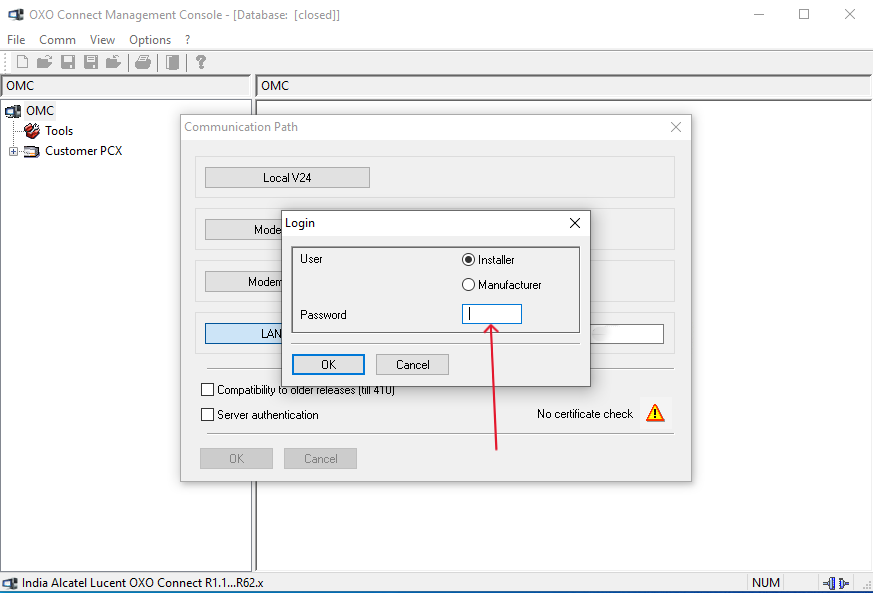

# 🔐 How to Log In to Alcatel OMC (Expert Mode)

Follow these steps to log in to the Alcatel OMC application in **Expert Mode**:

---

## 🧭 Step-by-Step Instructions

1. **Double-click** the OMC application to launch it.

2. In the main interface, click on the **"Expert"** option.

3. A new window will open — in this window:
   - Click on **"Comm"**
   - Then click **"Connect"**

4. You’ll now see a **text box** where you can enter the **Server IP Address**. Enter the correct **server IP**.

6. Proceed to **log in using your password** when prompted.

---

## ✅ Tips

- Make sure the OMC server is reachable over the network.
- Use the correct **IP address**, **port** (if required), and **login credentials**.
- If connection fails, verify firewall, network, or permission issues.